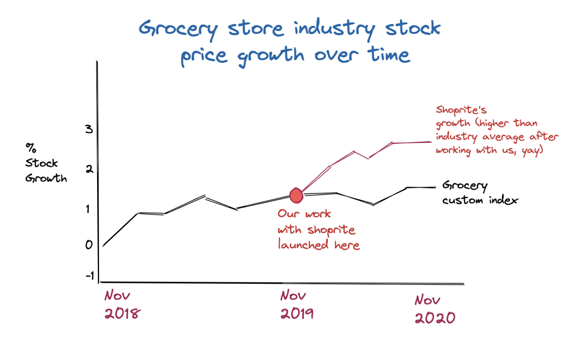

# KPI builder

This is a tool to show return on investment for client project work, in terms of stock price growth versus competitors.

The user can create a custom index to see how the specific client's competitors' stock prices are growing over time. 

The user then identifies who the client is and when the project launched. The program will create a graph that showcases how the client's stock has grown versus its competitors, after working with us. 

There are always a wide variety of factors that affect stock price growth, but hopefully this is one good datapoint within a series. 

